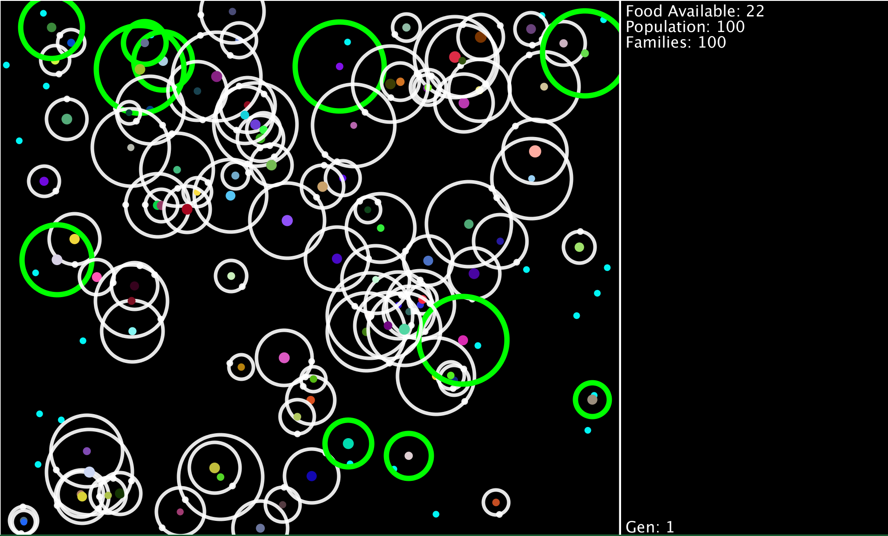

# Survival-of-the-Fittest

# This program generates a population of individuals each with different traits varying from speed, size, eye sight, and even how fast it
# takes them to
# eat. This simulation shows how a "fit" individual in a population benefits and has a increaced chance of survival in a enviroment with
# limited resources.
